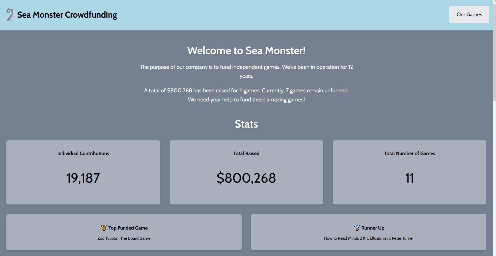

# WEB102 Prework - *Sea Monster Crowdfunding*

Submitted by: **Brian Velazquez**

**GamesDB** is a website for the company Sea Monster Crowdfunding that displays information about the games they have funded.

Time spent: **2** hours spent in total

## Required Features

The following **required** functionality is completed:

* [x] The introduction section explains the background of the company and how many games remain unfunded.
* [x] The Stats section includes information about the total contributions and dollars raised as well as the top two most funded games.
* [x] The Our Games section initially displays all games funded by Sea Monster Crowdfunding
* [x] The Our Games section has three buttons that allow the user to display only unfunded games, only funded games, or all games.

The following **optional** features are implemented:

* [x] Search functionality
* [x] Jump Button 
* [x] Improved CSS

## Video Walkthrough

Here's a walkthrough of implemented features:

<!-- Replace this with whatever GIF tool you used! -->
GIF created with ScreenToGif
## Notes

Working out how to make the search functionality was not difficult but rather understanding how the filtering function could be utilized. Other than the the CSS was updated to give the website some depth. 
